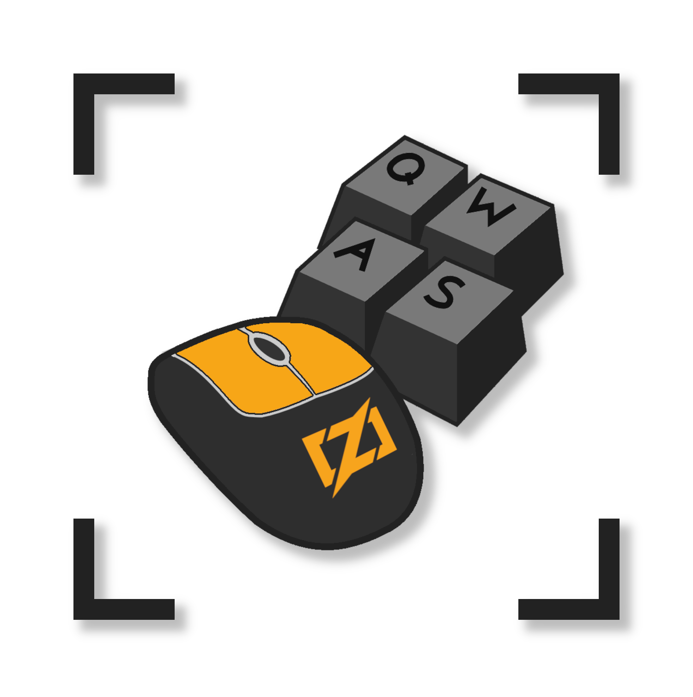

<!-- line breaks to center text -->
   

  <h3>Zinput</h4>
  <b>Cross-platform</b> library for <i>controling and monitoring</i> keyboard & mouse inputs 

    

  <a href="#getting-started"><b>Getting Started</b></a> - <a href="#platform-support"><b>Platform Support</b></a>

  

---

# Getting Started
*To be filled in later*

# Platform Support
As cool as it would be to have 100% bug free code, it's sadly not a reality. As such I've written up a table containing what Zinput *does and does not* support as of today.

|                       | **Windows** | **MacOS** | **X11** | **Wayland** |
|:---------------------:|:-----------:|:---------:|:-------:|:-----------:|
| **Mouse Control**     | ✅          | ✅          | ✅          | 🏃          |
| **Mouse Listener**    | 🏃          | 🏃          | 🏃          | 🏃          |
| **Keyboard Control**  | 🏃          | 🏃          | 🏃          | 🏃          |
| **Keyboard Listener** | 🏃          | 🏃          | 🏃          | 🏃          |

